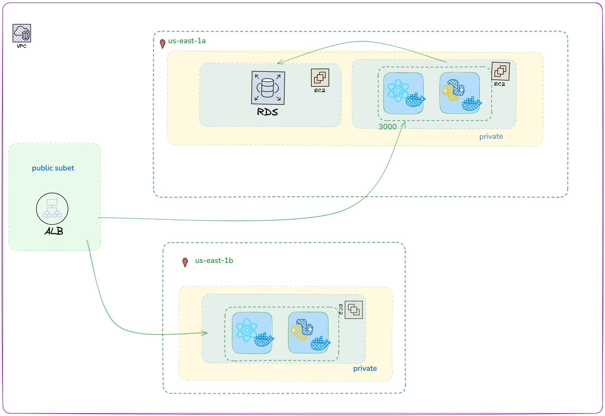

#  Dockerized Django Ecommerce on EC2



## Project Overview

This project is a Django-based ecommerce application with a React frontend, deployed on AWS EC2 instances. The infrastructure is managed using Terraform.

## Infrastructure Setup

The project uses Terraform to provision AWS resources:

Development VPC Infrastructure:

- 1 VPC (10.0.0.0/16)
- 2 Availability Zones
- 4 Subnets:
 - 2 Public (10.0.1.0/24, 10.0.2.0/24)
 - 2 Private (10.0.10.0/24, 10.0.11.0/24)
- 2 Route Tables:
 - Public (routes through Internet Gateway)
 - Private (routes through NAT Gateway)
- Internet Gateway
- NAT Gateway in public subnet
- Elastic IP for NAT Gateway
- 2 EC2 instances:
 - App EC2 in private subnet (running frontend/backend containers)
 - Bastion host in public subnet
- 1 RDS PostgreSQL instance in private subnet
- 1 Application Load Balancer in public subnets

Security Groups:
- ALB: Port 80 inbound from anywhere
- EC2: Ports 22, 3000, 8000 inbound
- RDS: Port 5432 inbound from EC2 SG and Jenkins IP
- Bastion: Port 22 inbound from anywhere
- All SGs allow all outbound traffic

For detailed Terraform configuration, see the [main.tf](./terraform/main.tf) file.

**Config**
- [Replace the key](./terraform/variables.tf#L23) you have or you'll have to add tf code to create a new key and output it so you can use it in the bastion. 

## Jenkins pipeline:

- The pipeline has a docker step that builds the [Dockerfile.backend](Dockerfile.backend) and [Dockerfile.frontend](Dockerfile.frontend). 
- The terraform step creates the VPC.
- The [terraform block](./terraform/main.tf#L199-L222) that creates the EC2 for that hosts the containers has [user data](./terraform/deploy.sh) that runs the [compose.yaml](./terraform/compose.yaml)
 - **POSSIBLE BUG**
    - If the user data doesn't run for some reason you'll have to use the bastion server to ssh into the ecommerce-app ec2 and run the user data manually
      ```
         sudo bash /var/lib/cloud/instance/user-data.txt
      ``` 

**Create a Jenkins infrastructure with a manager and a node.**

Node
   - name should be 'build-node' to correspond with name in Jenkinsfile
   - T3.medium, 20gb disk space
     
   - **Dependencies for Node**
      - docker.io
      - docker-compose
      - terraform

**Jenkins Credentials used by the pipepiline**   
   - Github token for repo. Save as password and username
   - Docker token for dockerbub account. Save as password and username. ID of credentials should be 'docker-hub-credentials' to correspond with name on Jenkinsfile

### Changes in Jenkinsfile
   - Replace name of the tag of the container to line up with the name of your repo (line 29 and line 39)
   - Replace the repository in the push command (line 33 and like 42)
